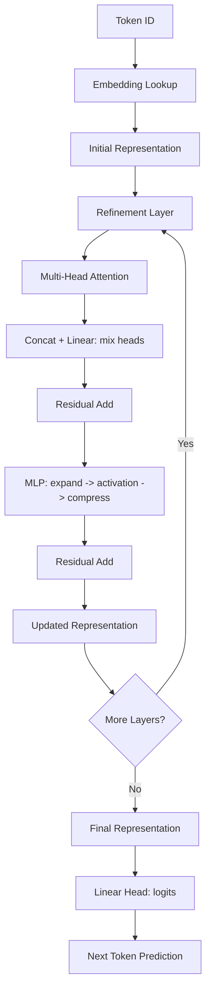

# Journey of a token Embedding

```mermaid
flowchart TD

A[Token ID] --> B[Embedding Lookup]
B --> R[Initial Representation]

R --> C[Refinement Layer]
C --> C1[Multi-Head Attention]
C1 --> C2[Concat + Linear: mix heads]
C2 --> C3[Residual Add]
C3 --> C4[MLP: expand -> activation -> compress]
C4 --> C5[Residual Add]
C5 --> D[Updated Representation]

D --> E{More Layers?}
E -->|Yes| C
E -->|No| H[Final Representation]

H --> I[Linear Head: logits]
I --> J[Next Token Prediction]
```

>  **Each layer applies the same refinement process to an updated token representation, not to the original embedding.**

